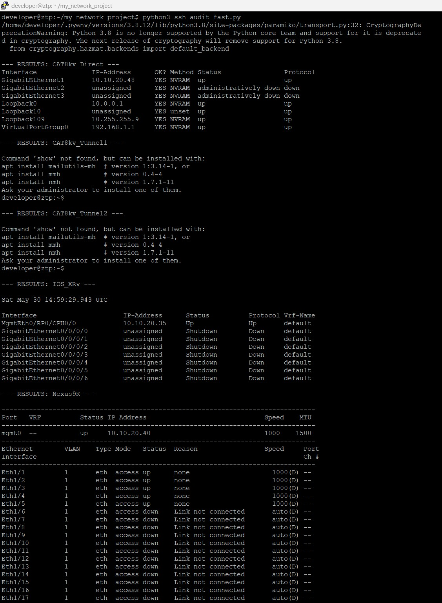

# Network Automation Framework



## Overview
A scalable, multi-threaded network discovery and auditing engine designed for heterogeneous network environments (IOS-XE, NX-OS, IOS-XR). This project automates operational state retrieval, reducing manual audit time by approximately 80%.

## Key Features
- **Scalable Inventory:** Decoupled inventory management using YAML.
- **High Performance:** Utilizes `concurrent.futures` for asynchronous multi-threading, enabling simultaneous audit across multiple devices.
- **Multi-Vendor Support:** Standardized data collection across Cisco IOS-XE, NX-OS, and IOS-XR platforms.
- **Robust Error Handling:** Implemented context managers and try-except blocks for production-grade reliability.

## Getting Started

### Prerequisites
- Python 3.8+
- `netmiko` and `pyyaml` libraries.

### Installation
```bash
pip install netmiko pyyaml
